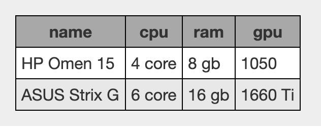
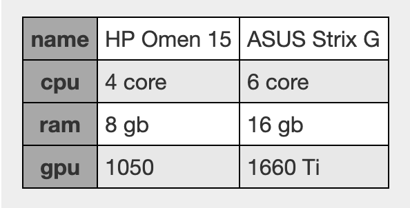

# Federated Wiki - Compare Plugin

This plugin, type: compare, allows one to compare multiple specs.

## Configuration

Edit a `compare` item to configure it.

If the first line of the item is `horiz`, the display will look like:


If the first line of the item is 'vert', the display will look like:


The default display layout is `horiz` if no layout is specified.

Specify the columns to display by putting them on a single line separated by spaces.

The first example on this page was configured as follows:
```
horiz
cpu ram gpu
```

The rows (for a horizontal layout) or the columns (for a vertical layout) are pulled from `specs` items up and to the left of the `compare` item.

To reorder the compared items, change the position of the corresponding `specs` item in the lineup.

To change the columns or order of columns displayed, edit the `compare` item to change its configuration.

## Build

    npm install

## License

MIT

## Usage